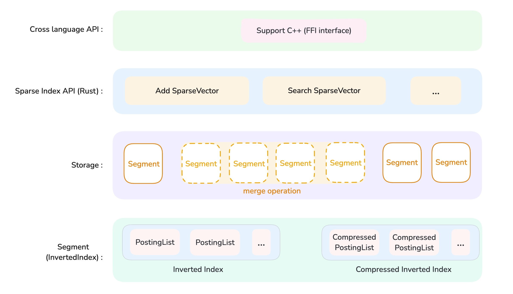

# SparseIndex

## Introduction

SparseIndex is a **Rust library** designed for sparse vector retrieval, indexing, and storage.

Developers can easily integrate this project into Rust or C++ projects. Here are some use cases:
- Quickly implement a Rust-based sparse vector search engine using this library along with [actix-web](https://crates.io/crates/actix-web).
- Integrate this library into [ClickHouse](https://github.com/ClickHouse/ClickHouse) (written in C++) to support sparse vector search in ClickHouse.

## Features Provided by SparseIndex

- Sparse vector search
    - Optimized sparse vector search
    - Unoptimized brute-force sparse vector search
- Index file storage and loading
    - Index data is stored on disk using an inverted index data structure
    - Index files are loaded from disk using mmap
    - Optionally, mmap files can be compressed or stored with u8 quantization to save space
- Multi-threaded index building support
- Automatic background merging of Segment-level indexes
- Supports f32, half::f16, and u8 floating-point types for storage
- Supports C++ FFI (Foreign Function Interface) for cross-language invocation
- TODO: Support for deleting SparseVectors from the index

## Project Structure

<div style="text-align: center;">
  
</div>

Let's break down the project structure of SparseIndex from bottom to top:

### 1. Segment (Inverted Index)

A Segment is the smallest unit of an index file. It uses the inverted index as the underlying data structure, which is a classic data structure widely used in text search.

We have implemented two types of inverted indices: `InvertedIndex` and `CompressedInvertedIndex`. Both types support enabling u8 quantization storage.
- `InvertedIndex` is a simple implementation of the inverted index, which typically offers better search performance.
- `CompressedInvertedIndex` uses the [BitPacking](https://docs.rs/bitpacking/latest/bitpacking/) compression library to compress `RowIds` data of type u32. As a result, sparse vector search may take longer.

### 2. Storage

In the process of adding a large number of sparse vectors to SparseIndex, we use multi-threading to perform concurrent index building. Typically, four threads are used to build the index, with each thread responsible for constructing one Segment. When a Segment is complete (i.e., its resources reach a threshold), it participates in the merge operation with other Segments. The automatic background Segment merge operation ensures that SparseIndex maintains an optimal number of Segments under high data volumes, which in turn guarantees search performance.

### 3. Sparse Index API (Rust)

This is the Index-level Rust interface. Each Index is bound to a directory on disk, where all Segment file building, merging, and destruction operations are carried out. Using the `Add` and `Search` interfaces provided by the Index, sparse vectors can be stored and searched. There are also other interfaces for index state management, such as the `Commit` interface, which represents committing the index state.

### 4. Cross-Language API

To enable cross-language integration with SparseIndex, we provide rich FFI function interfaces for C++. This helps with cross-language function calls. In the future, we may consider supporting additional language types.

## Development Instructions

### 1. Library Compilation and Testing

#### a. Compiling the Library

The toolchain's version:

```bash
❯ cargo version                          
cargo 1.79.0 (ffa9cf99a 2024-06-03)
```

Execute the following command to compile the SparseIndex library in release mode:

```bash
cargo build --release
```

After the compilation is complete, you can find the `.a` file (compiled product) in the `target` directory. To integrate this into a C++ project, you will need to link this `.a` file and use the C++ header files in the `includes` folder to call the SparseIndex FFI functions.

#### b. Testing the Library

Execute the following command to perform unit tests and integration tests for the library:

```bash
cargo test
```

### 2. FFI Interface Development Process

If the existing FFI interfaces do not meet your C++ project needs, you will need to learn how to add new FFI interfaces. Below is the process for adding new FFI function interfaces:

#### Step 1: Fork the Repository

If you wish to contribute your custom FFI interfaces to this repository, please fork the repository, modify the code, and submit the changes.

#### Step 2: Declare the New FFI Function Interface

FFI function interfaces are declared in the `src/lib.rs` file, which also indicates that this Rust project is a library.

You can declare your custom FFI function interfaces within the `ffi` module scope:

```rust
#[cxx::bridge(namespace = "SPARSE")]
pub mod ffi {
    /* ... */
    extern "Rust" {
        /* ... */
        // Your custom FFI function
        pub fn ffi_test_func();
    }
}
```

#### Step 3: Implement the FFI Function Interface

The actual implementation of FFI functions is located in the `src/api/cxx_ffi` directory. Developers can refer to existing FFI interface implementations and add new FFI function implementations here, along with relevant unit tests and integration tests.

#### Step 4: Update the C++ Header File

Once the FFI function is developed, you need to run the following command to generate the header file for C++ linkage:

```bash
cxxbridge src/lib.rs --header > include/sparse_index_cxx.h
```