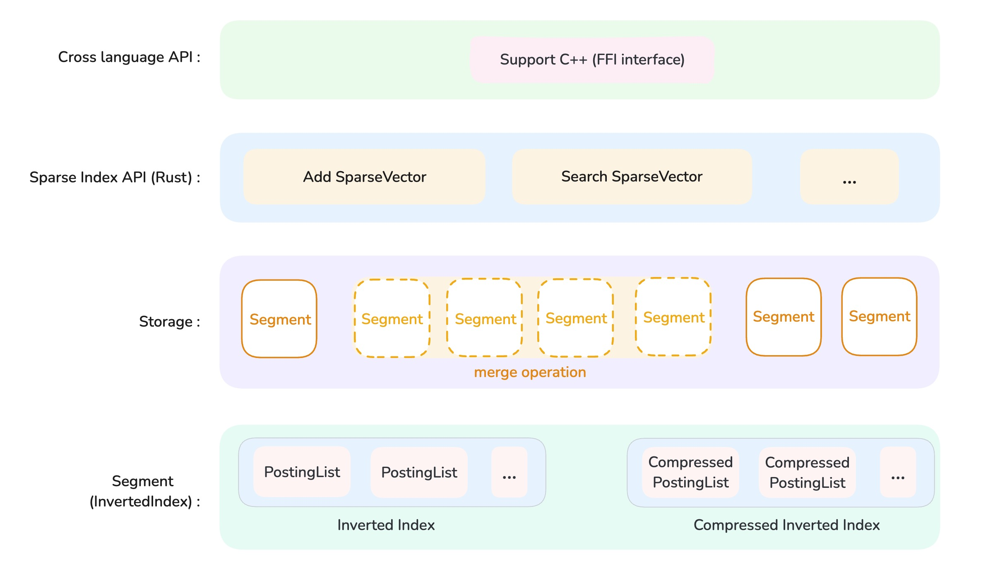

# SparseIndex

## 简介

SparseIndex 是一个专门用来执行稀疏向量检索、索引以及存储的一个 **Rust Lib 库**。

开发人员可以方便的将本项目集成到 Rust 项目或 C++ 项目，下面是一些使用场景：
- 基于此 Lib 库和 [actix-web](https://crates.io/crates/actix-web) 快速实现一个 Rust 稀疏向量搜索引擎。
- 将该 Lib 库集成到 [ClickHouse](https://github.com/ClickHouse/ClickHouse) (Written by C++)，以支持 ClickHouse 稀疏向量搜索

## SparseIndex 提供的功能

- SparseSearch 稀疏向量检索
    - 优化的稀疏向量检索
    - 未优化的稀疏向量暴力检索
- 索引文件的存储和加载
    - 索引数据以倒排索引的数据结构存储在磁盘
    - 以 mmap 方式加载磁盘上的索引文件
    - 可选择对 mmap 文件进行压缩存储、u8 量化存储来节省存储空间
- 支持多线程索引构建
- Segment 级别索引后台自动合并
- 支持 f32, half::f16 以及 u8 类型浮点数存储
- 支持 C++ 语言 FFI 跨语言调用接口
- TODO: 支持在索引中删除 SparseVector

## 项目结构

<div style="text-align: center;">
  
</div>

让我们从下往上层层解析 SparseIndex 的项目结构：

### 1. Segment（Inverted Index）

Segment 是最小的索引文件单元，它使用了倒排索引 Inverted Index 作为底层数据结构，倒排索引是一个经典的数据结构，广泛应用于文本检索。

我们实现了两种倒排索引类型，分别是 `InvertedIndex` 和 `CompressedInvertedIndex`。这两种类型都支持开启 u8 量化存储。
- `InvertedIndex` 是倒排索引的简洁实现，通常来说它的搜索性能更好。
- `CompressedInvertedIndex` 使用 [BitPacking](https://docs.rs/bitpacking/latest/bitpacking/) 压缩库对 u32 类型的 `RowIds` 数据进行压缩，相应的，在执行稀疏向量搜索时可能会消耗更长时间。

### 2. Storage

在向 SparseIndex 添加大量的稀疏向量过程中，我们会使用多线程执行索引并发构建，通常来说会有 4 个线程用来构建索引，每个线程负责构建 1 个 Segment，当该 Segment 构建完毕时（资源达到阈值）就会参与和其它 Segments 的 merge 操作。后台自动的 Segment Merge 操作能够保证 SparseIndex 在高数据量下合理的 Segments 数量，进而保证搜索性能。

### 3. Sparse Index API (Rust)

这是 Index 级别的 Rust 接口，每个 Index 会和磁盘上的一个目录进行绑定，该 Index 所有的 Segments 文件构建、合并、销毁流程都会在这个目录下完成。通过 Index 提供的 `Add` 和 `Search` 接口，可以完成稀疏向量的存储和搜索，另外也有别的接口用来进行索引的状态管理，如 `Commit` 接口，表示提交索引状态。

### 4. Cross language API

为了使 SparseIndex 支持跨语言集成，我们首先为 C++ 提供了丰富的 FFI 函数接口，帮助完成跨语言函数调用。后续我们也会考虑支持更多的语言类型。

## 开发说明

### 1. Lib 库编译与测试

#### a. lib 库编译

执行下属命令以 release 模式编译 SparseIndex lib 库。

```bash
cargo build --release
```

编译完成后，我们可以在 target 目录下找到以 .a 为后缀的编译产物。若需将其集成到 C++ 项目中，需要链接该 .a 文件，并通过 includes 文件夹中的 C++ 头文件调用 SparseIndex 实现的 FFI 函数。

#### b. lib 库测试

执行下属命令来完成 lib 库的单元测试、集成测试。

```bash
cargo test
```


### 2. FFI 接口开发流程

如果现有的 FFI 接口不能够满足你的 C++ 项目，那么你需要了解如何新增新的 FFI 接口，以下是新增 FFI 函数接口的流程：

#### Step1. Fork 本仓库

如果你考虑将自己的 FFI 接口贡献给本仓库，请 Fork 后修改代码并提交更改。

#### Step2. 新增 FFI 函数接口声明

FFI 函数接口的声明位于 `src/lib.rs` 文件，此文件也表示该 Rust 项目是一个 lib 库。

你可以将自定义的 FFI 函数接口声明写在 ffi 模块作用域内:

```rust
#[cxx::bridge(namespace = "SPARSE")]
pub mod ffi {
    /* ... */
    extern "Rust" {
        /* ... */
        // your customize ffi function
        pub fn ffi_test_func();
    }
}
```

#### Step3. 实现 FFI 函数接口

FFI 函数的具体实现位于 `src/api/cxx_ffi` 目录，开发人员可以参考现有的 FFI 接口实现，并在此处增加新的 FFI 函数实现，以及相关的单元测试、集成测试。

#### Step4. 更新 C++ 头文件

在 FFI 函数开发完毕后，需要执行下述命令生成 header 文件，供 C++ 链接调用。
```bash
cxxbridge src/lib.rs --header > include/sparse_index_cxx.h
```
